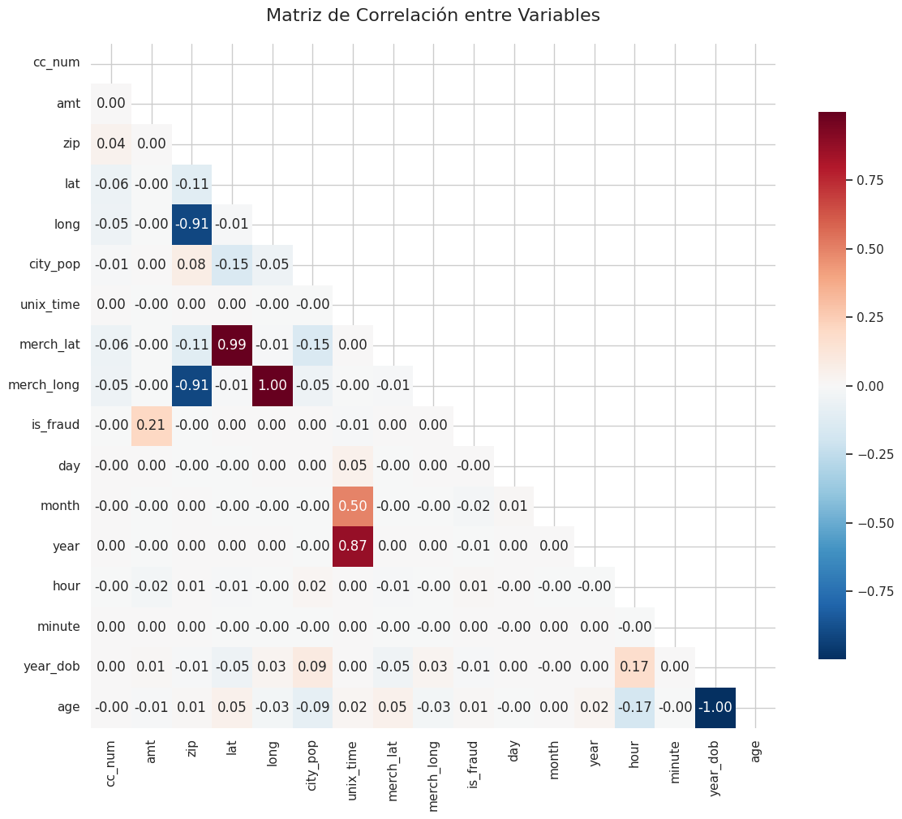

# Reporte de Datos

## Resumen general de los datos

El conjunto de datos analizado contiene información sobre transacciones de tarjetas de crédito. Se compone de 1,852,394 observaciones (filas) y 22 columnas (variables). No se encontraron valores faltantes ni duplicados en el conjunto de datos. Se realizaron transformaciones iniciales para convertir las columnas de fecha y hora (`trans_date_trans_time`, `dob`) a formato `datetime` y se crearon nuevas variables derivadas como `day`, `month`, `year`, `hour`, `minute`, `year_dob`, y `age`. Luego del procesamiento de datos se crean variables auxiliares y se seleccionan seis (6) variables categóricas para el modelo, así como once (11) variables numéricas para el modelo.

## Resumen de calidad de los datos

La calidad del conjunto de datos es alta en términos de integridad:
*   **Valores Faltantes:** No se encontraron valores nulos en ninguna de las columnas.
*   **Duplicados:** No se identificaron filas duplicadas.
*   **Errores:** No se reportan errores evidentes en los tipos de datos tras las correcciones iniciales.
*   **Valores Extremos:** Se identificaron valores atípicos, especialmente en variables como `amt` (monto de la transacción) y `age` (edad del titular) dentro del subconjunto de transacciones fraudulentas (7,318 y 42 outliers respectivamente, usando el criterio del rango intercuartílico).

## Variable objetivo

La variable objetivo es `is_fraud`, que indica si una transacción es fraudulenta (1) o no (0). La distribución de esta variable muestra un desbalance extremo: la gran mayoría de las transacciones son legítimas (0), mientras que las fraudulentas (1) representan un porcentaje muy pequeño del total. Este desbalance es característico en problemas de detección de fraudes.

## Variables individuales

Se analizaron tanto variables categóricas como numéricas:
*   **Variables Categóricas (ej. `category`, `gender`, `state`, `job`):** Se exploró la distribución de categorías y su tasa de fraude asociada. Por ejemplo, la categoría `shopping_net` mostró una alta tasa de fraude, al igual que ciertos trabajos (Air traffic controller, Careers adviser, etc.) y el estado `DE`.
*   **Variables Numéricas (ej. `amt`, `age`, coordenadas geográficas):** Se examinaron sus distribuciones mediante histogramas y boxplots. Se observó que las transacciones fraudulentas tienden a tener montos (`amt`) y edades (`age`) más altos, con una presencia notable de valores atípicos en estas variables.
*   **Transformaciones:** Se crearon nuevas variables a partir de las fechas (`day`, `month`, `year`, `hour`, `minute`) y se calculó la edad (`age`) del titular.

### Distribución de variables numéricas respecto del fraude

### Distribución de variables categóricas respecto del fraude

## Ranking de variables

Mayores variable con correlación respecto de la variable objetivo:

## Ranking de Variables

Basado en el análisis exploratorio del notebook proporcionado, aquí se presenta un ranking de las variables más influyentes o relevantes para predecir la variable objetivo `is_fraud`, ordenadas de mayor a menor relevancia según la evidencia encontrada:

1.  **`category` (Categoría de la transacción):**
    *   **Relevancia:** Alta. La categoría `shopping_net` mostró una tasa de fraude significativamente más alta que otras categorías. Esto indica que el tipo de compra es un fuerte predictor de fraude.
    *   **Evidencia:** Análisis de tasa de fraude por categoría mostrando `shopping_net` como la de mayor riesgo.

2.  **`job` (Ocupación del titular):**
    *   **Relevancia:** Alta. Algunas ocupaciones mostraron tasas extremas de fraude (100% o 0%). Esto sugiere que ciertas profesiones pueden estar más asociadas con comportamientos fraudulentos en los datos.
    *   **Evidencia:** Top 10 y Bottom 10 de trabajos por tasa de fraude, con profesiones mostrando 100% o ~0% de fraude.

3.  **`amt` (Monto de la transacción):**
    *   **Relevancia:** Moderada-Alta. Las transacciones fraudulentas tienden a tener montos más altos. Se observó una correlación positiva leve (0.22 en la matriz original, 0.27 en la codificada) y diferencias notables en la distribución.
    *   **Evidencia:** Boxplots mostrando distribución diferente para `amt` entre fraudes y no fraudes, y valor de correlación.

4.  **`year` (Año de la transacción):**
    *   **Relevancia:** Alta (según correlación codificada). Mostró una fuerte correlación positiva con `is_fraud` en el análisis de correlación con variables codificadas. También se observó una correlación alta (0.87) en la matriz original de variables numéricas.
    *   **Evidencia:** Valor de correlación alto en la matriz.

5.  **`age` (Edad del titular):**
    *   **Relevancia:** Moderada. La distribución de la edad difiere entre transacciones fraudulentas y no fraudulentas. Especialmente, el grupo de edad 80-89 años mostró la mayor tasa de fraude. Se observó una correlación negativa (-0.17).
    *   **Evidencia:** Gráfico de tasa de fraude por grupo de edad y boxplots.

6.  **`state` (Estado del titular):**
    *   **Relevancia:** Moderada. Algunos estados, como `DE`, mostraron tasas de fraude considerablemente más altas que otros.
    *   **Evidencia:** Análisis de tasa de fraude por estado mostrando `DE` como el de mayor riesgo.

7.  **`hour` (Hora de la transacción):**
    *   **Relevancia:** Moderada. Hubo patrones en la tasa de fraude a lo largo del día. Se observó una correlación negativa moderada (-0.38) en el análisis codificado.
    *   **Evidencia:** Análisis de tasa de fraude por hora del día.

8.  **`month` (Mes de la transacción):**
    *   **Relevancia:** Moderada. Algunos meses mostraron tasas de fraude más altas. Se observó una correlación moderada (+0.50) en el análisis codificado.
    *   **Evidencia:** Análisis de tasa de fraude por mes mostrando febrero como el de mayor riesgo.

9.  **`city` (Ciudad del titular):**
    *   **Relevancia:** Baja-Moderada. Algunas ciudades individuales mostraron tasas de fraude más altas o más bajas, pero el efecto puede ser menos generalizable que el de `state`.
    *   **Evidencia:** Top 10 y Bottom 10 de ciudades por tasa de fraude.

10. **`gender` (Género del titular):**
    *   **Relevancia:** Baja-Moderada. Se observó una diferencia en la tasa de fraude entre hombres y mujeres, aunque no tan pronunciada como otras variables.
    *   **Evidencia:** Análisis de tasa de fraude por género.

11. **`day` (Día del mes de la transacción):**
    *   **Relevancia:** Baja. Algunos días del mes mostraron ligeramente más o menos fraude, pero el patrón no es tan fuerte.
    *   **Evidencia:** Análisis de tasa de fraude por día del mes.

12. **`merchant` (Comerciante):**
    *   **Relevancia:** Baja. Aunque algunos comerciantes pueden tener tasas anormales, como variable individual no mostró un efecto agregado muy fuerte comparado con `category`.
    *   **Evidencia:** Correlación muy baja en el análisis codificado.

13. **`lat` y `long` (Ubicación del titular):**
    *   **Relevancia:** Muy Baja. No se encontró una relación lineal significativa con `is_fraud`.
    *   **Evidencia:** Correlación cercana a cero con `is_fraud` en la matriz original.

14. **`merch_lat` y `merch_long` (Ubicación del comerciante):**
    *   **Relevancia:** Variable. Mostraron correlaciones extremadamente altas con `is_fraud` en el análisis codificado, lo cual es inusual y podría requerir investigación adicional. En el análisis original no mostraron relación lineal clara.
    *   **Evidencia:** Correlaciones altas en la matriz codificada, correlación perfecta entre ellas mismas.

15. **`city_pop` (Población de la ciudad):**
    *   **Relevancia:** Muy Baja. No mostró una relación clara con la tasa de fraude.
    *   **Evidencia:** Correlaciones bajas en la matriz original y codificada.

## Relación entre variables explicativas y variable objetivo

El análisis exploratorio reveló varias relaciones interesantes entre las variables explicativas y la variable objetivo `is_fraud`:
*   **Monto (`amt`):** Las transacciones fraudulentas tienden a tener montos más altos, con una correlación positiva leve (0.22).
*   **Categoría (`category`):** La categoría `shopping_net` tiene una tasa de fraude significativamente más alta.
*   **Género (`gender`):** Se observó una diferencia en la tasa de fraude entre hombres y mujeres.
*   **Ubicación (`state`, `city`, `job`):** Ciertos estados, ciudades y profesiones muestran tasas de fraude extremas.
*   **Fecha y Hora (`month`, `day`, `hour`):** Hay patrones temporales en la ocurrencia de fraudes.
*   **Edad (`age`):** Las transacciones fraudulentas tienden a estar asociadas con edades más altas, siendo el grupo 80-89 el de mayor tasa.
*   **Año (`year`):** Fuerte correlación positiva (0.87) con la variable de fraude.
*   **Coordenadas Geográficas:** No se encontró una relación lineal significativa entre la ubicación del comerciante (`merch_lat`, `merch_long`) y la variable `is_fraud`.

### MAtriz de Correlaciones

