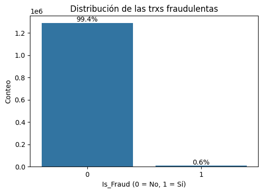
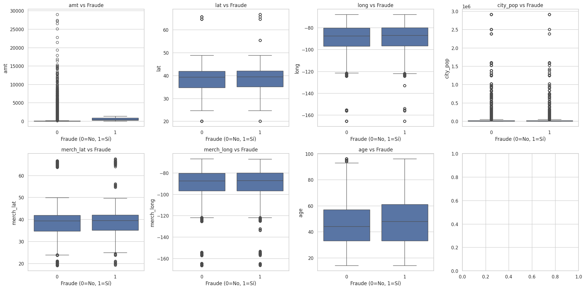
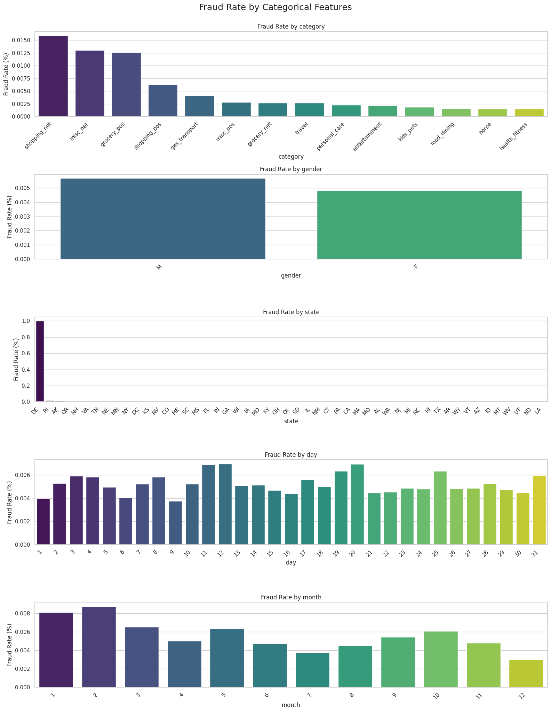
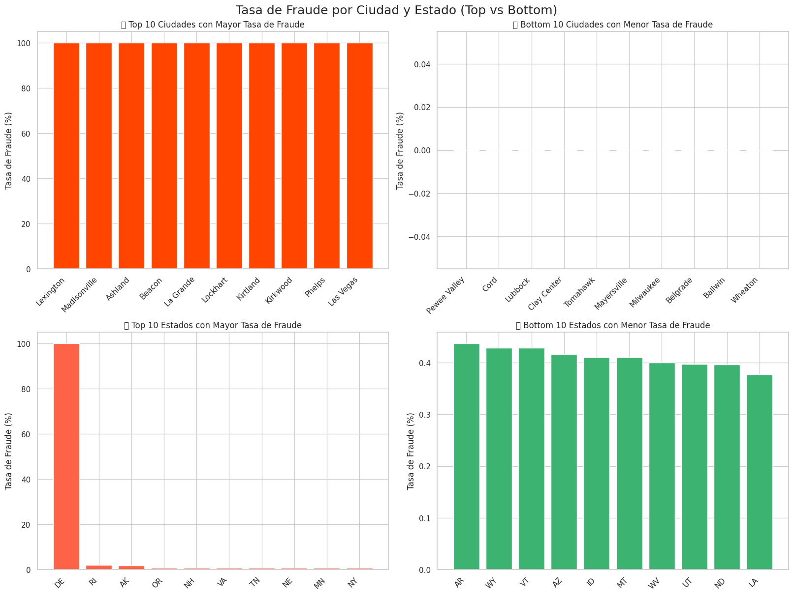
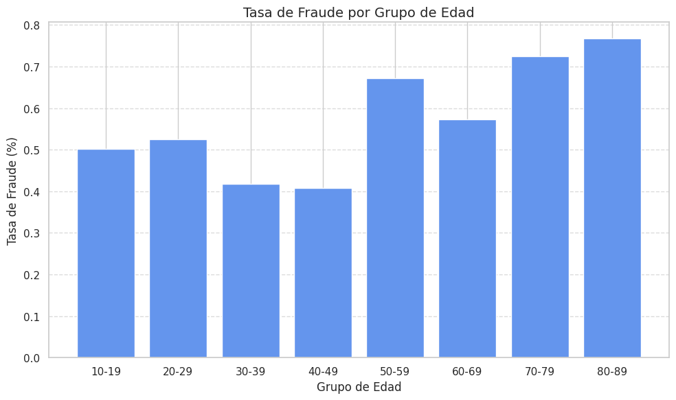
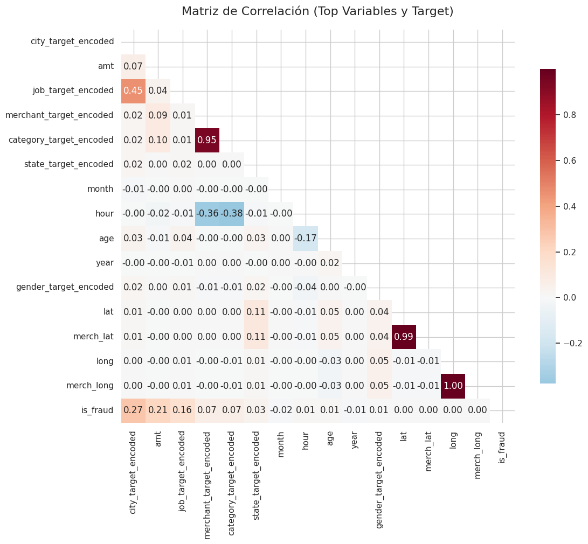

# Reporte de Datos

## Resumen general de los datos

El conjunto de datos analizado contiene información sobre transacciones de tarjetas de crédito. Se compone de 1,852,394 observaciones (filas) y 22 columnas (variables). No se encontraron valores faltantes ni duplicados en el conjunto de datos. Se realizaron transformaciones iniciales para convertir las columnas de fecha y hora (`trans_date_trans_time`, `dob`) a formato `datetime` y se crearon nuevas variables derivadas como `day`, `month`, `year`, `hour`, `minute`, `year_dob`, y `age`. Luego del procesamiento de datos se crean variables auxiliares y se seleccionan seis (6) variables categóricas para el modelo, así como once (11) variables numéricas para el modelo.

## Resumen de calidad de los datos

La calidad del conjunto de datos es alta en términos de integridad:
*   **Valores Faltantes:** No se encontraron valores nulos en ninguna de las columnas.
*   **Duplicados:** No se identificaron filas duplicadas.
*   **Errores:** No se reportan errores evidentes en los tipos de datos tras las correcciones iniciales.
*   **Valores Extremos:** Se identificaron valores atípicos, especialmente en variables como `amt` (monto de la transacción) y `age` (edad del titular) dentro del subconjunto de transacciones fraudulentas (7,318 y 42 outliers respectivamente, usando el criterio del rango intercuartílico).

## Variable objetivo

La variable objetivo es `is_fraud`, que indica si una transacción es fraudulenta (1) o no (0). La distribución de esta variable muestra un desbalance extremo: la gran mayoría de las transacciones son legítimas (0), mientras que las fraudulentas (1) representan un porcentaje muy pequeño del total. Este desbalance es característico en problemas de detección de fraudes.

## Variables individuales

Se analizaron tanto variables categóricas como numéricas:
*   **Variables Categóricas (ej. `category`, `gender`, `state`, `job`):** Se exploró la distribución de categorías y su tasa de fraude asociada. Por ejemplo, la categoría `shopping_net` mostró una alta tasa de fraude, al igual que ciertos trabajos (Air traffic controller, Careers adviser, etc.) y el estado `DE`.
*   **Variables Numéricas (ej. `amt`, `age`, coordenadas geográficas):** Se examinaron sus distribuciones mediante histogramas y boxplots. Se observó que las transacciones fraudulentas tienden a tener montos (`amt`) y edades (`age`) más altos, con una presencia notable de valores atípicos en estas variables.
*   **Transformaciones:** Se crearon nuevas variables a partir de las fechas (`day`, `month`, `year`, `hour`, `minute`) y se calculó la edad (`age`) del titular.

### Distribución de variables numéricas respecto del fraude

### Distribución de variables categóricas respecto del fraude

## Ranking de variables

Mayores variable con correlación respecto de la variable objetivo:

## Ranking de Variables

Basado en el análisis exploratorio del notebook proporcionado, aquí se presenta un ranking de las variables más influyentes o relevantes para predecir la variable objetivo `is_fraud`, ordenadas de mayor a menor relevancia según la evidencia encontrada:

## Ranking de variables por correlación con `is_fraud`

| Posición | Variable                   | Correlación |
|----------|----------------------------|-------------|
| 1        | city_target_encoded        | 0.27        |
| 2        | amt                        | 0.21        |
| 3        | job_target_encoded         | 0.16        |
| 4        | merchant_target_encoded    | 0.07        |
| 5        | category_target_encoded    | 0.07        |
| 6        | state_target_encoded       | 0.03        |
| 7        | month                      | -0.02       |
| 8        | hour                       | 0.01        |
| 9        | age                        | -0.01       |
| 10       | year                       | 0.01        |
| 11       | gender_target_encoded      | 0.00        |
| 12       | lat                        | 0.00        |
| 13       | long                       | 0.00        |
| 14       | merch_lat                  | 0.00        |
| 15       | merch_long                 | 0.00        |

## Relación entre variables explicativas y variable objetivo

El análisis exploratorio reveló varias relaciones interesantes entre las variables explicativas y la variable objetivo `is_fraud`:
*   **Monto (`amt`):** Las transacciones fraudulentas tienden a tener montos más altos, con una correlación positiva leve (0.22).
*   **Categoría (`category`):** La categoría `shopping_net` tiene una tasa de fraude significativamente más alta.
*   **Género (`gender`):** Se observó una diferencia en la tasa de fraude entre hombres y mujeres.
*   **Ubicación (`state`, `city`, `job`):** Ciertos estados, ciudades y profesiones muestran tasas de fraude extremas.
*   **Fecha y Hora (`month`, `day`, `hour`):** Hay patrones temporales en la ocurrencia de fraudes.
*   **Edad (`age`):** Las transacciones fraudulentas tienden a estar asociadas con edades más altas, siendo el grupo 80-89 el de mayor tasa.
*   **Año (`year`):** Fuerte correlación positiva (0.87) con la variable de fraude.
*   **Coordenadas Geográficas:** No se encontró una relación lineal significativa entre la ubicación del comerciante (`merch_lat`, `merch_long`) y la variable `is_fraud`.

### MAtriz de Correlaciones

